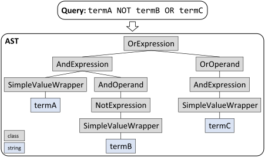

The advanced search query converts user input to a valid SQL where clause. This is achieved with the help of a parser. The parser is generated programmatically with [Peggy](https://github.com/peggyjs/peggy) and the [PHPeggy](https://github.com/marcelbolten/phpeggy) plugin. Peggy uses [parsing expression grammar](http://en.wikipedia.org/wiki/Parsing_expression_grammar) (PEG) formalism.

The grammar file `src/node/grammar/queryGrammar.pegjs` is the input for the parser compilation and uses [Peggy v.1.0.0 grammar syntax and semantics](https://github.com/peggyjs/peggy/tree/v1.0.0#grammar-syntax-and-semantics). The parser is compiled at build-time and located at `cache/advancedSearchQuery/Parser.php`.

The parser will build an abstract syntax tree AST with the grammar elements (PHP classes) located in `src/services/advancedSearchQuery/grammar/`: `AndExpression`, `AndOperand`, `DateField`, `Field`, `NotExpression`, `OrExpression`, `OrOperand`, and `SimpleValueWrapper`. The grammar file defines the hierarchy of the grammar elements but additionally the hierarchy is reflected by the parameter type hinting.

After the AST is build successfully (syntax errors are reported to the user) it can be visited. Here the visitor pattern is used and there are tree visitors located in `src/services/advancedSearchQuery/visitors`: `DepthValidatorVisitor`, `FieldValidatorVisitor`, and `QueryBuilderVisitor`. 

1. `DepthValidatorVisitor` checks the complexity of the query. How deep it the AST? (Not used currently.)
2. `FieldValidatorVisitor` checks if fields/values are allowed, e.g., the `timestamped` field is only meaningful for experiments. Feedback is given for illegal fields/values.
3. `QueryBuilderVisitor` is the workhorse and builds the SQL where clause.

The `FieldValidatorVisitor` and `QueryBuilderVisitor` use collectors (`src/services/advancedSearchQuery/collectors`) to collect all the invalid fields and the where clause, respectively.

`VisitorParameters` can be used to inject additional data into the AST, e.g., the entity type to check if a field (`timestamped`) is allowed for experiments/database.

`src/services/AdvancedSearchQuery.php` brings together the three steps, parsing/AST building, validation, and SQL where clause generation.

